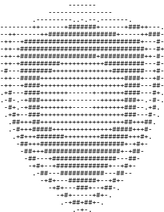

# Sneed-Reactivity 

Cross-Platform Open Reactive AntiMalware

## Credits

* VirusTotal - Creating Yara
* [ReversingLabs - Creating Some Yara Rules](https://github.com/reversinglabs/reversinglabs-yara-rules)
* [Yara23x0 - Creating more Yara Rules](https://github.com/Neo23x0/signature-base)
* [mikesxrc - Creating a compilation of even MORE yara rules (had to delete some to clean the console a tad...)](https://github.com/mikesxrs/Open-Source-YARA-rules)
* Sneed Group - Creating the idea/code
* ChatGPT/Gemini - Helping code this amazing project

## Licensing Details

* LICENSE-YARA-RULES-REVERSINGLABS - ReversingLab's Yara Rules (under the yara-ReversingLabs subdirectory)
* LICENSE-YARA-RULES-NEO23X0 - NEO23X0's Yara Rules (under the yara-Neo23x0 subdirectory)
* LICENSE - Our code. (Pretty much any .py file in the main directory as well as requirements.txt)
* mikesxrs sadly had no license in his Yara Rules repo, so I guess take that for what you will.
